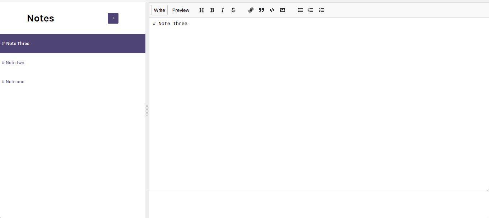

# Notes App 

> This is a project to practice how localStorage can be used to retain infomation on the web page when the browser refreshes with other interesting features in React.

## ScreenShot

## Live Demo
[Live Demo](https://qoosim-notes-app.netlify.app/) :point_left:
